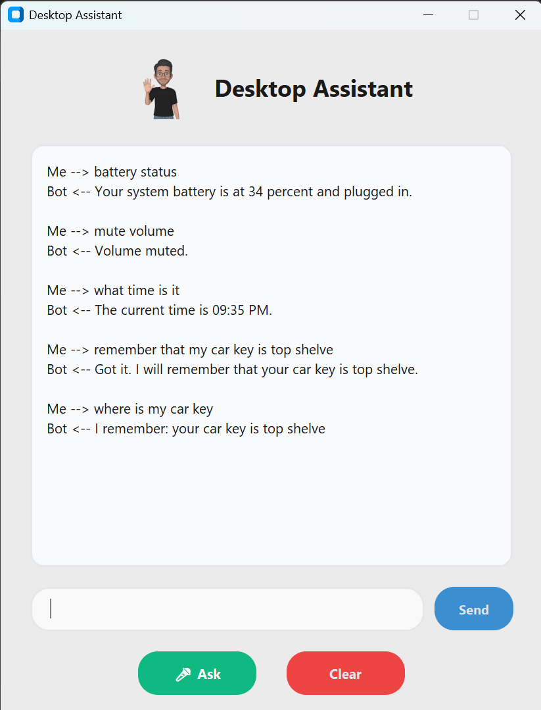

# Desktop Assistant - Smart Virtual Companion



A highly capable, multithreaded desktop virtual assistant built entirely in Python. This local companion features a modern Tkinter (CustomTkinter) GUI, persistent long-term memory via SQLite, and fuzzy string matching for robust, typo-tolerant command recognition.

## 🚀 Features

* **System Automation:** Control system volume, check battery status, take screenshots, and manage storage (empty recycle bin) directly from the chat.
* **Persistent Local Memory:** Integrated SQLite database allows the assistant to remember user facts and locations across reboots, complete with natural pronoun inversion (e.g., changes "my" to "your" when saving).
* **Typo-Tolerant Brain:** Utilizes `thefuzz` for fuzzy string matching to accurately process and execute commands even if they are misspelled.
* **Multithreaded & Responsive UI:** Background tasks and the text-to-speech (`pyttsx3`) engine run on separate threads safely managed via Windows COM objects, ensuring the GUI never freezes.
* **Proactive Background Routines:** Uses the `schedule` library to automatically wake up and run background tasks (like morning news and time briefings) without user input.
* **Web & App Navigation:** Instantly search Google, open YouTube videos, fetch Wikipedia summaries, and launch local system applications.

## 🛠️ Tech Stack

* **Language:** Python 3.11
* **GUI:** Tkinter / CustomTkinter
* **Database:** SQLite3
* **Libraries:** `pyttsx3`, `thefuzz`, `schedule`, `pyautogui`, `psutil`, `winshell`, `wikipedia`, `pywin32`

## ⚙️ Installation

1. **Clone the repository:**
```bash
   git clone [https://github.com/ay-india/Desktop_Assistant.git](https://github.com/ay-india/Desktop_Assistant.git)
   cd Desktop_Assistant
```

2. **Install the required dependencies:**

Make sure you have Python installed, then run:

```bash
pip install pyttsx3 thefuzz schedule pyautogui psutil winshell wikipedia requests pywin32 customtkinter
```

3. **Run the application:**

```bash
python gui.py
```

## 💬 Command Reference

The assistant uses fuzzy matching, so commands do not need to be typed perfectly. Here is a list of tasks the assistant can perform:

* `take a screenshot`
* `battery status`
* `clean my system` or `empty recycle bin`
* `volume up` or `volume down` or `mute volume`
* `open [application name]`
* `search [query]`
* `play [video] on youtube`
* `remember that [fact]`
  *(e.g., "remember that my car key is top shelve")*
* `where is [item]` or `what is my [item]`
* `what time is it`
* `weather` or `weather in [city]`
* `tell me the news`
* `tell me a joke`
* `wikipedia [topic]`
* `hello`
* `shutdown` or `quit`

## 📂 Project Structure

* **gui.py** - The main CustomTkinter interface and UI loop.
* **action.py** - The central router that processes inputs, handles fuzzy matching, and triggers functions.
* **memory.py** - The SQLite database manager for saving and recalling facts.
* **routine.py** - The background scheduler for automated, proactive alerts.
* **speak.py** - The Windows COM-managed text-to-speech engine.

## 👨‍💻 Author

**Ashish Yadav**

GitHub: @ay-india


   
